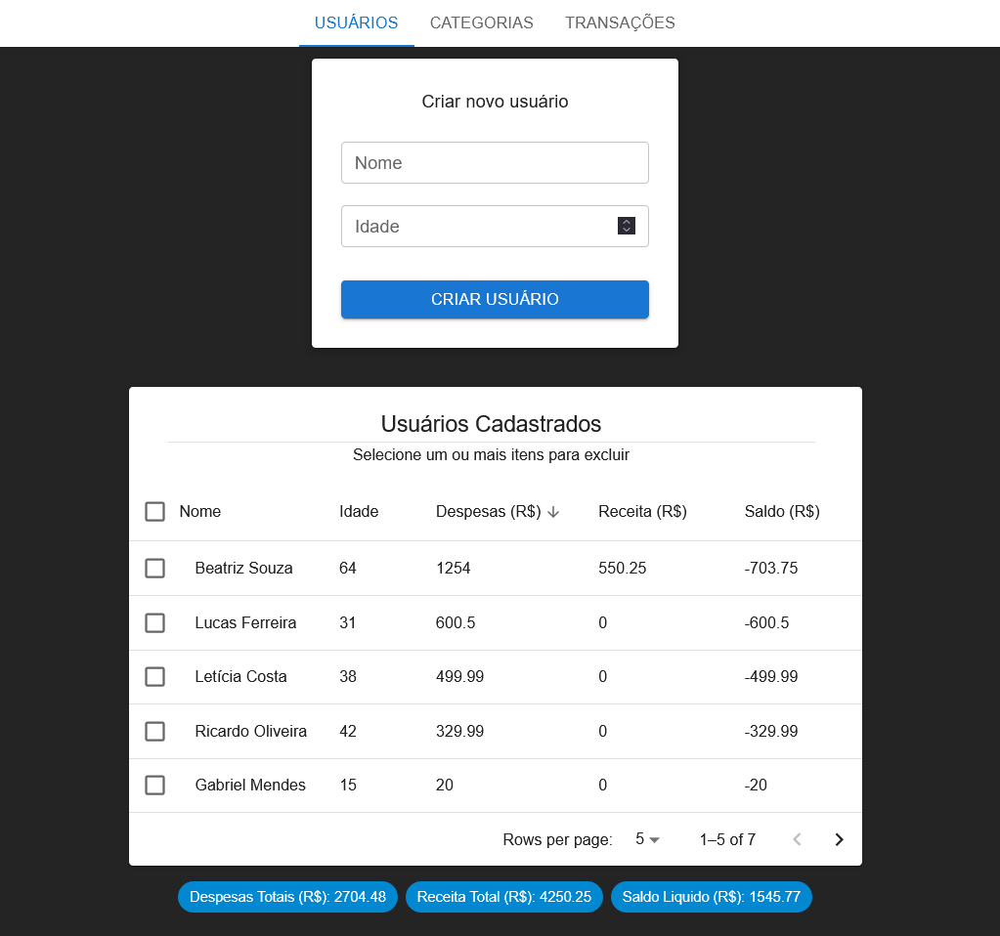
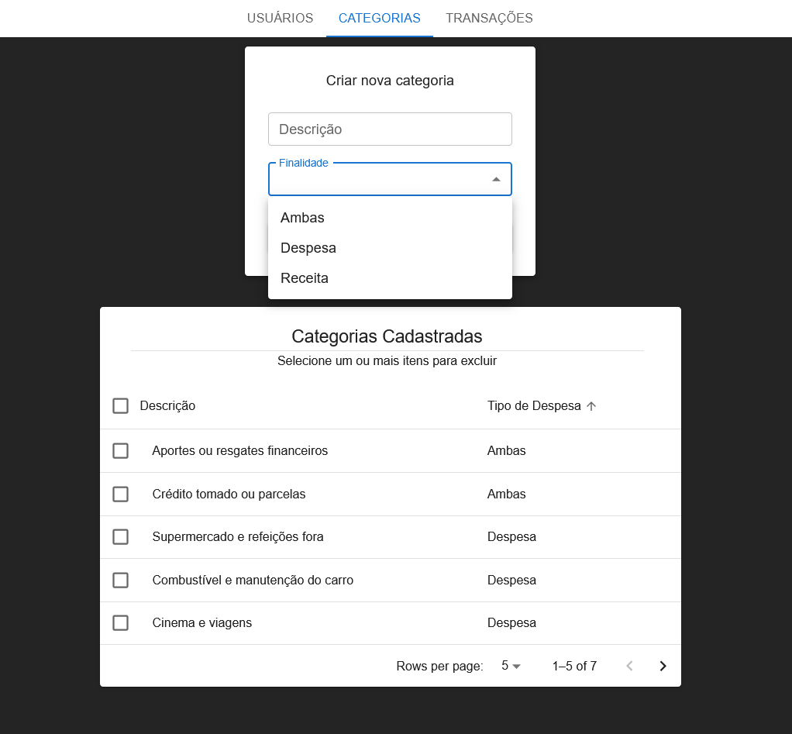
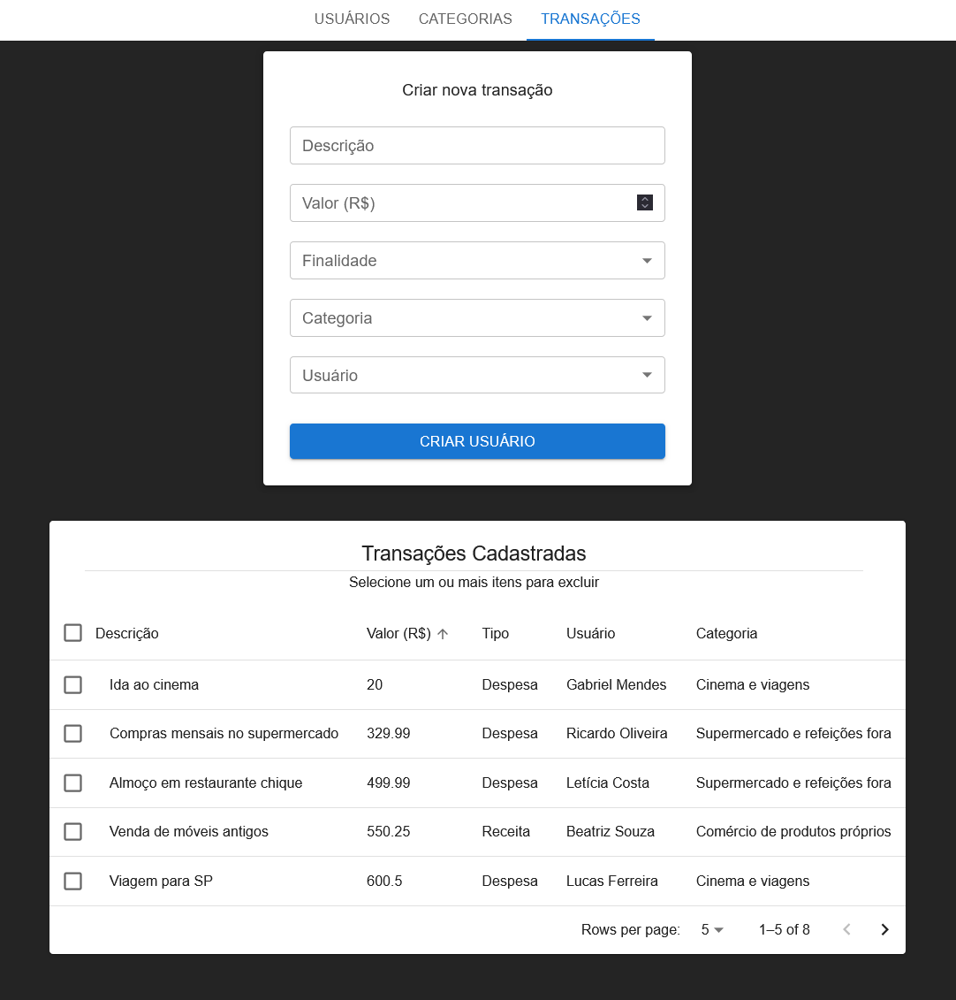

# Website para gastos residenciais

### Sumário
  * [Descrição do Projeto](#descrição-do-projeto)
  * [Backend](#backend)
  * [Stack utilizada](#stack-utilizada)
  * [Instalação](#instalação)
  * [Detalhes Técnicos](#detalhes-técnicos)
  * [Screenshots](#screenshots)
    + [Tela de visualização e cadastro dos usuários](#tela-de-visualização-e-cadastro-dos-usuários)
    + [Tela de visualização e cadastro de categorias](#tela-de-visualização-e-cadastro-de-categorias)
    + [Tela de visualização e cadastro de transações](#tela-de-visualização-e-cadastro-de-transações)
  * [Licença](#licen-a)


## Descrição do Projeto
Esse repositório armazena o código-fonte do frontend (ou seja, o *client*) para um aplicativo web de gerenciamento de gastos residênciais. 

Atráves do aplicativo é possivel adicionar, visualizar e remover dados das entidades:

- Usuário, possui informações de nome, idade e transações vinculadas. 
- Categória, possui uma descrição e o tipo de despesa.
- Transação, armazena uma descrição, valor, finalidade (Receita ou Despesa), categória e usuário.

## Backend

Além do frontend, também foi desenvolvido um projeto de backend em .NET. Que também tem um guia de detalhes técnicos e instalação: 

[Link para o Repositório do backend.](https://github.com/Wr3tchedTorch/gastos-residenciais-server)

## Stack utilizada

**Front-end:** React, TypeScript, Vite, Axios, Material UI.

**Back-end:** .NET, C#, EF Core, Mapster, MySql.

## Instalação

1. Clone o repositório ou faça download do código-fonte:

```bash
  git clone https://github.com/Wr3tchedTorch/gastos-residenciais-client
```

2. No diretório principal (onde o arquivo package.json está localizado), rode os seguintes comandos:

```bash
  npm i
```

```bash
  npm run dev
```
Depois que o segundo comando finalizar sua execução, o projeto estará funcionando. Nesse ponto é só abrir a URL do projeto no navegador:

http://localhost:5173/

NOTA: O aplicativo não funcionará sem o backend estar em execução, um guia para instalar e executar o backend pode ser encontrado no link:

[Link do README do backend](https://github.com/Wr3tchedTorch/gastos-residenciais-server/blob/master/README.md)

## Detalhes Técnicos

Este projeto foi desenvolvido em TypeScript para garantir mais legibilidade e organização no código. Que permite uma melhor manutenabilidade do software, já que a tipagem estática do TypeScript permite um código mais robusto e reduz a taxa de erros.

O framework utilizado foi o React. Por ser uma ferramenta poderosa e moderna, ele garante que o aplicativo seja performático e eficiente. Aproveitando ao máximo os recursos disponíveis por meio de técnicas de renderização e cache.

Também foram utilizadas bibliotecas para otimizar o desenvolvimento, como: Axios, para requisições HTTP; e a Material UI, para o design de componentes como as tabelas e os formulários.

## Screenshots

### Tela de visualização e cadastro dos usuários



### Tela de visualização e cadastro de categorias



### Tela de visualização e cadastro de transações



## Licença

[GPL-3.0](https://choosealicense.com/licenses/gpl-3.0/)